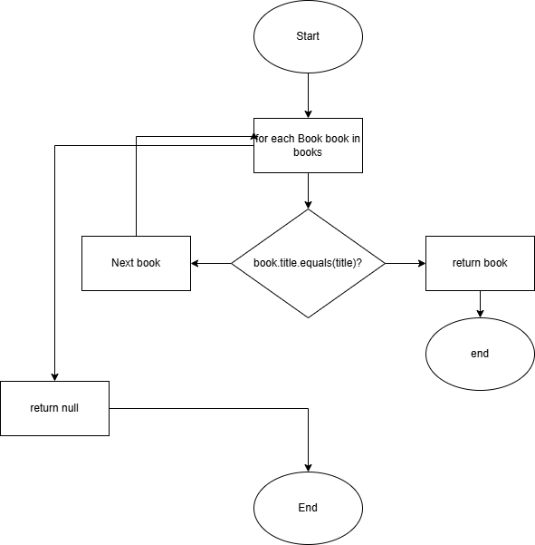
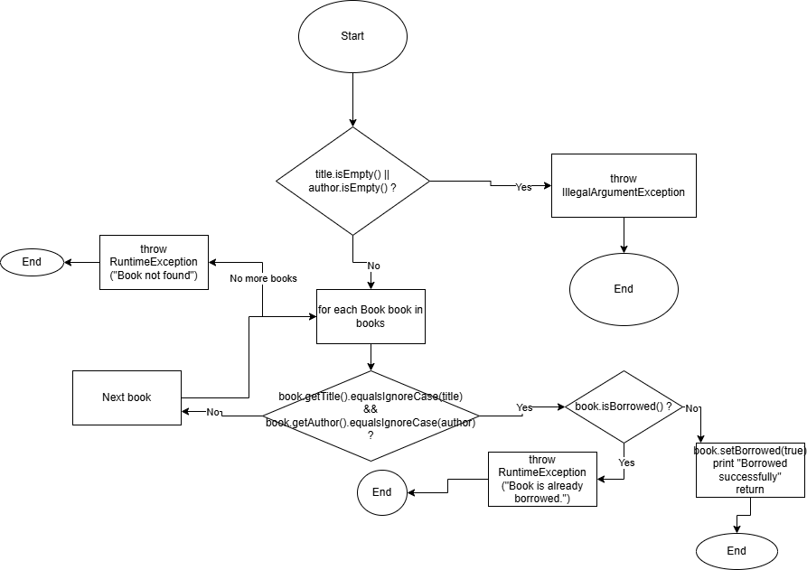

# SI_lab2_243063

Filip Tanevski

Index: 243063

## Control Flow Graphs

### searchBookByTitle

### borrowBook

## Cyclomatic Complexity

### searchBookByTitle()

Decision points:

1. if (title.isEmpty())
2. for (Book book : books)
3. if (book.getTitle().equalsIgnoreCase(title) && !book.isBorrowed())
4. if (results.isEmpty())

Cyclomatic complexity = 4 + 1 = 5

### borrowBook()

Decision points:

1. if (title.isEmpty() || author.isEmpty())
2. for (Book book : books)
3. if (book.getTitle().equalsIgnoreCase(title) && book.getAuthor().equalsIgnoreCase(author))
4. if (!book.isBorrowed())

Cyclomatic complexity = 4 + 1 = 5
